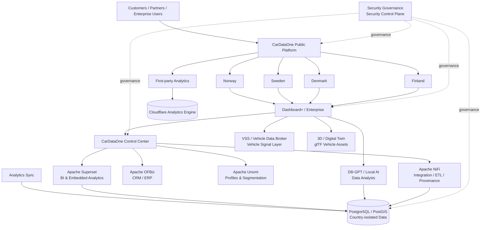

CarDataOne
European Vehicle Data Infrastructure
Vehicle data · Reporting · Analytics · APIs · AI · Digital Twin · Enterprise Services
cardataone.com

Platform overview
CarDataOne is a modular vehicle-data platform built around isolated country environments, shared presentation and analytics layers, private data services, and centralized security governance.
The public GitHub profile presents the architecture and platform structure. Production source code, credentials, customer data, authority integrations, database secrets, payment configuration and internal deployment details remain private.
The current platform is structured around four country environments:
Norway · Sweden · Denmark · Finland
Each country environment is treated as an independent production boundary with its own runtime configuration, data sources, credentials, storage and authorization scope.
Architecture

Core platform layers
Layer	Role
Country platforms	Isolated vehicle-data and reporting environments for Norway, Sweden, Denmark and Finland
Dashboard+ / Enterprise	Shared customer and enterprise dashboard layer with country-specific service bindings
Control Center	Central administration and orchestration surface
Analytics	First-party event collection, Cloudflare analytics and PostgreSQL-based reporting pipelines
Business intelligence	Apache Superset for embedded BI and analytical dashboards
CRM / ERP	Apache OFBiz integration layer
Customer intelligence	Apache Unomi and Unomi Tracker for profiles, events and segmentation
Data integration	Apache NiFi for ETL, synchronization and provenance
AI / data analysis	DB-GPT and local-model tooling for database and analytical workflows
Vehicle data standards	COVESA VSS and vehicle-data broker components
3D / digital twin	glTF-based vehicle assets and browser-oriented digital-twin capabilities
Security	Central governance, authorization gates, audit controls and security control plane

Country isolation
CarDataOne uses a strict country-isolation model.
Each country environment maintains its own:
- runtime configuration
- Worker deployment
- data sources
- customer and report data
- database/storage bindings
- API and authority credentials
- payment configuration
- analytics identifiers
- authorization scope
- audit boundary
Source code and generic UI components may be reused across markets, but production credentials, customer data, payment state, database bindings and authority integrations are not shared across country boundaries.
Cloud and deployment model
The active application architecture is built around Cloudflare Workers and Git-connected deployment.
Private GitHub repository
        ↓
Cloudflare Workers Builds
        ↓
Build validation
        ↓
Wrangler deployment
        ↓
Country / platform Worker
        ↓
Public or protected route
The primary application stack uses:
- Cloudflare Workers
- Wrangler
- React Router
- TypeScript
- Vite
- Cloudflare Analytics Engine
- Durable Objects where required
- PostgreSQL / PostGIS
- Cloudflare Hyperdrive where required
Production deployments follow the repository-defined deployment contract. GitHub is the source of truth for application code; Cloudflare is the runtime and deployment platform for the active web applications.
Data and analytics architecture
CarDataOne separates operational country data from analytical and presentation services.
The analytics architecture includes:
Country platforms / Dashboard / Enterprise
                 ↓
        First-party event collection
                 ↓
     Cloudflare Analytics Engine

Cloudflare analytics sources
                 ↓
       Scheduled analytics sync
                 ↓
      Country-separated databases
                 ↓
         PostgreSQL / PostGIS
                 ↓
      Superset / Control Center
Country-level analytical datasets remain separated for Norway, Sweden, Denmark and Finland.
Dashboard and enterprise architecture
Dashboard+ is a shared application layer with separate service bindings toward the country runtimes.
The architecture allows common UI, analytics, reporting, 3D and AI components to be reused while preserving country-specific runtime and data boundaries.
Enterprise functionality is designed around server-side authorization, scoped data access and controlled service bindings rather than direct browser access to country systems.
Security architecture
Security is treated as a cross-cutting platform layer rather than an application-specific feature.
The security model includes:
- centralized security governance
- explicit work authorization
- fail-closed access controls
- country-specific security cells
- server-side authentication and authorization
- least-privilege runtime bindings
- audit logging
- protected administrative surfaces
- separation of source code, runtime secrets and production data
- no credentials or production secrets stored in the public profile repository
Production systems are designed to deny privileged or paid operations when required authorization, entitlement or configuration is missing.
Vehicle-data and digital-twin layer
The platform contains dedicated components for structured vehicle information and 3D representation.
This includes:
- COVESA Vehicle Signal Specification (VSS)
- VSS tooling
- vehicle-data broker components
- structured vehicle-signal handling
- glTF-based 3D assets
- browser-based vehicle visualization
- digital-twin and simulation-oriented dashboard components
These components form part of the technical foundation used by CarDataOne's reporting, dashboard and enterprise layers.
AI and automation
CarDataOne uses private/local AI and data-analysis tooling as part of the internal platform architecture.
AI-related components are used for:
- database analysis
- Text-to-SQL workflows
- report and KPI analysis
- vehicle-data analysis
- market-data analysis
- geospatial/PostGIS analysis
- automated operational workflows
- controlled assistant interfaces
AI services do not replace country isolation, authorization, payment controls or security governance.
Repository model
The CarDataOne / Regnrbil GitHub environment uses a multi-repository architecture.
The public profile repository is intentionally limited to architecture and company presentation. Production repositories remain private.
Repositories are separated by function, including:
Country applications
Infrastructure and deployment policy
Security governance
Security control plane
Dashboard and enterprise applications
Control Center
Analytics ingestion
Business intelligence
CRM / ERP
Customer intelligence
Data integration
AI / database analysis
Vehicle-data standards
Vehicle-data brokering
3D / digital-twin assets
Developer and operational tooling
This README intentionally does not expose private repository contents, credentials, secrets, database identifiers, internal network topology or private deployment endpoints.
Technology foundation
Application & edge
Cloudflare Workers · Wrangler · React Router · TypeScript · Vite
Data
PostgreSQL · PostGIS · Cloudflare Hyperdrive · Cloudflare Analytics Engine
Analytics & enterprise
Apache Superset · Apache NiFi · Apache OFBiz · Apache Unomi
AI
DB-GPT · Ollama · local-model workflows
Vehicle data
COVESA VSS · vehicle-data broker components
3D
glTF · browser-based vehicle visualization · digital-twin components
Security
central governance · security control plane · country isolation · fail-closed authorization
Public presentation scope
This profile represents the CarDataOne / Regnrbil vehicle-data infrastructure only.
Unrelated projects, experimental deployments, non-vehicle platforms and separate business initiatives are intentionally excluded from this architecture presentation.

CarDataOne
European vehicle data infrastructure, analytics, APIs and automotive intelligence.
https://cardataone.com

Profile Architecture README · V1.0.0 · 2026-09-25

