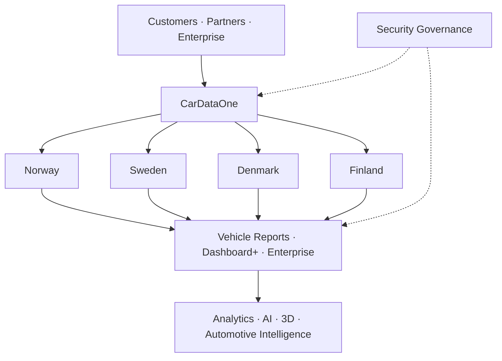

<picture>
  <source media="(prefers-color-scheme: dark)" srcset="./assets/branding/cardataone-dark.png">
  <source media="(prefers-color-scheme: light)" srcset="./assets/branding/cardataone-light.png">
  
</picture>

# European Vehicle Data Platform

**Vehicle Data · Insights · Reporting · Analytics · AI · 3D**

[cardataone.com](https://cardataone.com)

---

## CarDataOne

CarDataOne is a European vehicle-data platform for digital vehicle information, reporting, analytics and automotive intelligence.

The public platform currently represents services for **Norway, Sweden, Denmark and Finland**.

This profile is a public company presentation. It intentionally shows only the platform areas and overall structure.

---

## Platform structure

The diagram is intentionally high-level and is not an implementation guide.

---

## Platform areas

| Area | Description |
| --- | --- |
| Vehicle data | Structured vehicle information and data services |
| Vehicle reports | Digital vehicle reporting and decision support |
| Dashboard+ | Interactive customer-facing vehicle insights |
| Enterprise | Professional tools and analytical services |
| Analytics | Business intelligence and data-driven insights |
| APIs | Controlled vehicle-data integration services |
| AI | Automotive intelligence and assisted analysis |
| 3D & digital twin | Browser-based vehicle visualization |
| Security | Security governance and controlled access |
| Nordic markets | Norway, Sweden, Denmark and Finland |

---

## Official websites

| Market | Website |
| --- | --- |
| CarDataOne | [cardataone.com](https://cardataone.com) |
| Norway / Regnrbil | [regnrbil.no](https://regnrbil.no) |
| Sweden | [cardataone.com/se/](https://www.cardataone.com/se/) |
| Denmark | [cardataone.com/dk/](https://www.cardataone.com/dk/) |
| Finland | [cardataone.com/fi/](https://www.cardataone.com/fi/) |

---

## Brand

<table>
<tr>
<td align="center">
<picture>
  <source media="(prefers-color-scheme: dark)" srcset="./assets/branding/cardataone-dark.png">
  <source media="(prefers-color-scheme: light)" srcset="./assets/branding/cardataone-light.png">
  
</picture>
 <strong>CarDataOne</strong>
</td>
<td align="center">
<picture>
  <source media="(prefers-color-scheme: dark)" srcset="./assets/branding/regnrbil-dark.png">
  <source media="(prefers-color-scheme: light)" srcset="./assets/branding/regnrbil-light.png">
  
</picture>
 <strong>Regnrbil Norway</strong>
</td>
</tr>
</table>

---

## Public profile scope

This public profile presents CarDataOne / Regnrbil at company and platform level. Detailed implementation material is intentionally not published here.

**Vehicle Data · Insights · A Safer Tomorrow**

[cardataone.com](https://cardataone.com)

Profile README · V1.3.0 · 2026-09-25

